# SOFTWARE FREEDOM DAY 2026 (SFD 2026)
### Department of Computer Science and Engineering
### Jaya Engineering College, Thirunindravur, Chennai

---

## 📅 Official Master Event Agenda & Timeline

- **Reporting Time:** 08:30 AM
- **Inauguration:** 09:00 AM Sharp
- **Competitions & Workshops:** 10:15 AM – 03:45 PM
- **Valedictory & Award Ceremony:** 04:00 PM – 04:45 PM
- **Final Dispersal:** 05:00 PM

---

## 📊 Visual Timeline Flowchart

```mermaid
gantt
    title Software Freedom Day 2026 Event Schedule
    dateFormat  HH:mm
    axisFormat  %I:%M %p
    
    section General
    Registration & Check-In    :08:30, 09:00
    Grand Inaugural Ceremony   :09:00, 10:00
    High Tea & Transition      :10:00, 10:15
    Lunch Break                :13:00, 13:45
    Valedictory & Awards       :16:00, 16:45
    National Anthem & Dispersal:16:45, 17:00

    section Event Tracks
    Track 01 Demo Stall        :10:15, 15:30
    Track 02 Mini Hackathon    :10:15, 15:30
    Track 03 Poster Designing  :10:30, 13:00
    Track 04 FOSS Workshop     :13:45, 15:45
    Track 05 Tech Debate Arena :13:45, 15:45
```

---

## ⏰ Chronological Master Timeline (09:00 AM – 05:00 PM)

| Time Slot | Program / Milestone | Venue | Session Highlights |
| :--- | :--- | :--- | :--- |
| **08:30 AM – 09:00 AM** | **Registration & Desk Check-In** | Auditorium Lobby | Participant kit collection, badge allocation, and stall allotment |
| **09:00 AM – 10:00 AM** | **Grand Inaugural Ceremony & Keynote** | **Auditorium** | • Tamizh Thaai Vaazhthu • Lighting of the Kuthuvilakku • Welcome Address by HOD (Dept of CSE) • Presidential Address by Principal • Keynote Address by Chief Guest on Open Source & Technology Freedom • Event Track Briefing & Rules Announcement |
| **10:00 AM – 10:15 AM** | **High Tea & Track Transition** | Auditorium Foyer | Refreshments and movement to respective competition areas |
| **10:15 AM – 01:00 PM** | **Morning Track Sessions** | Auditorium | • **Track 01: Demo Stall Exhibition (Round 1)** *(Auditorium)* • **Track 02: Mini Hackathon — Sprint Phase 1** *(Auditorium)* • **Track 03: Poster Designing Challenge** *(Auditorium)* |
| **01:00 PM – 01:45 PM** | **Lunch Break & Networking** | College Dining Hall | Lunch for participants, judges, and student coordinators |
| **01:45 PM – 03:45 PM** | **Afternoon Track Sessions** | Auditorium | • **Track 01: Demo Stall (Jury Evaluation & Final Review)** *(Auditorium)* • **Track 02: Mini Hackathon — Code Freeze & Pitching** *(Auditorium)* • **Track 04: Hands-on FOSS Workshop (Linux & Git)** *(Auditorium)* • **Track 05: Tech Debate Arena (Prelims & Finals)** *(Auditorium)* |
| **03:45 PM – 04:00 PM** | **Jury Score Consolidation & Break** | Faculty Conference Room | Score evaluation, certificate preparation, and seating in Auditorium |
| **04:00 PM – 04:45 PM** | **Valedictory & Grand Award Ceremony** | **Auditorium** | • Valedictory Address by Guest of Honour • Prize Distribution (Cash Awards, Trophies & Merit Certificates) for all 5 Event Tracks • Coordinator Recognition & Volunteer Appreciation • Vote of Thanks |
| **04:45 PM – 05:00 PM** | **National Anthem, Group Photo & Dispersal** | Auditorium | • National Anthem • Official Photo Session with Dignitaries, Winners & Organizing Committee • Participant Dispersal |

---

## 🏛️ Event Tracks & Venue Overview

| Track # | Event Title | Format & Team Size | Time Window | Venue | Student Coordinator |
| :---: | :--- | :---: | :---: | :--- | :--- |
| **01** | **Demo Stall** | Team of 3 (60 Stalls) | 10:15 AM – 03:30 PM | Auditorium | **D Hariprasath** |
| **02** | **Mini Hackathon** | Team of 4 | 10:15 AM – 03:30 PM | Auditorium | **Nishanth** |
| **03** | **Poster Designing** | Team of 2 / Solo | 10:30 AM – 01:00 PM | Auditorium | **Rajeshwari** |
| **04** | **Workshop** | Individual | 01:45 PM – 03:45 PM | Auditorium | **Ram siva Sundara Karthikeyan** |
| **05** | **Tech Debate Arena** | Team of 2 / 5 | 01:45 PM – 03:45 PM | Auditorium | **Rahul Raj** |

---

## 📋 Session Breakdown by Track

### Track 01: Demo Stall
- **10:15 AM – 11:30 AM:** Stall setup, hardware check, prototype booting.
- **11:30 AM – 01:00 PM:** Round 1 jury inspection and visitor demonstrations.
- **01:00 PM – 01:45 PM:** Lunch Break.
- **01:45 PM – 03:15 PM:** Round 2 final jury scoring and project evaluations.
- **03:15 PM – 03:30 PM:** Stall packing and movement to Auditorium.

### Track 02: Mini Hackathon
- **10:15 AM – 10:30 AM:** Release of problem statements & Git repo setup.
- **10:30 AM – 01:00 PM:** Intensive coding sprint phase 1.
- **01:00 PM – 01:45 PM:** Lunch Break.
- **01:45 PM – 03:00 PM:** Coding sprint phase 2 & code freeze (Pull Request submission).
- **03:00 PM – 03:30 PM:** Live 3-minute pitch & demo to jury panel.

### Track 03: Poster Designing
- **10:30 AM – 10:45 AM:** Theme announcement & brief.
- **10:45 AM – 12:30 PM:** Digital poster creation / design sprint.
- **12:30 PM – 01:00 PM:** Poster submission and jury walkthrough.

### Track 04: Hands-on FOSS Workshop
- **01:45 PM – 02:45 PM:** Module 1: Linux terminal fundamentals, Bash scripting & CLI superpowers.
- **02:45 PM – 03:45 PM:** Module 2: Git internals, branching, rebasing, and open-source GitHub pull requests.

### Track 05: Tech Debate Arena
- **01:45 PM – 02:30 PM:** Preliminary Round (Draw of lots for motion/proposition).
- **02:30 PM – 03:15 PM:** Semi-Final Round (Rebuttals & Cross-examination).
- **03:15 PM – 03:45 PM:** Grand Final Round (Open vs Closed AI / Tech Ethics).
